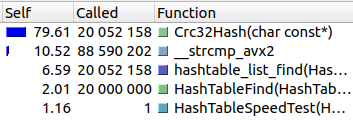
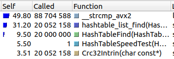

# Исследование и сравнение хеш-функций

В этой части работы оценивалась пригодность различных хеш-функций для хеширования английскиих слов и использования в хеш-таблице с цепочками.

### Исследуемые функци

#### 1. Const1Hash

Функция, всегда возвращающая 1.

```C
uint64_t Const1Hash (const char *str)
{
    return 1;
}
```

#### 2. FirstSymbHash

Функция, возвращающая ASCII-код первого символа.

```C
uint64_t FirstSymbHash (const char *str)
{
    return *str;
}
```

#### 3. StrlenHash

Функция, возвращающая длину строки.

```C
uint64_t StrlenHash (const char *str)
{
    return strlen (str);
}
```
#### 4. RolHash

На каждом шаге значение хеша циклически сдвигается влево, после чего делается xor с ASCII-кодом следующего символа.

```C
uint64_t RorHash (const char *str)
{
    uint64_t hash = 0;

    while (*str != '\0')
    {
        hash = ( (hash << 1) | (hash >> (sizeof (hash) * 8 - 1) ) ) ^ *(str++);
    }

    return hash;
}
```

#### 5. RorHash

То же, что и RorHash, но сдвиг делается вправо.

```C
uint64_t RolHash (const char *str)
{
    uint64_t hash = 0;

    while (*str != '\0')
    {
        hash = ( (hash >> 1) | (hash << (sizeof (hash) * 8 - 1) ) ) ^ *(str++);
    }

    return hash;
}
```

#### 6. [Crc32](https://ru.wikibooks.org/wiki/%D0%A0%D0%B5%D0%B0%D0%BB%D0%B8%D0%B7%D0%B0%D1%86%D0%B8%D0%B8_%D0%B0%D0%BB%D0%B3%D0%BE%D1%80%D0%B8%D1%82%D0%BC%D0%BE%D0%B2/%D0%A6%D0%B8%D0%BA%D0%BB%D0%B8%D1%87%D0%B5%D1%81%D0%BA%D0%B8%D0%B9_%D0%B8%D0%B7%D0%B1%D1%8B%D1%82%D0%BE%D1%87%D0%BD%D1%8B%D0%B9_%D0%BA%D0%BE%D0%B4)

```C
uint64_t Crc32Hash (const char *str)
{
    uint32_t ret = 0xFFFFFFFF;

    while (*str != '\0')
    {
        ret ^= *(str++);

        for (int i = 0; i < 8; i++)
        {
            ret = (ret & 1) ? (ret >> 1) ^ 0xEDB88320 : ret >> 1;
        }
    }
    return ret;
}
```

### Входные данные

Для исследования функций в хеш-таблицу было загружено 104316 различных английских слов.\
Размер хеш таблицы — 9973.\
Таким образом средняя длина цепочки равна 10,46.

### Результаты тестов

Для каждой функции построим график зависимости длины цепочки от хеша и посчитаем стандартное отклонение длины цепочки:

#### 1. Const1Hash


Стандартное отклонение: 1044,57

#### 2. FirstSymbHash


Видно, что диапазон значений функции гораздо меньше размеров таблицы, поэтому приблизим ту часть графика, где длины цепочек ненулевые.


Стандартное отклонение: 212,84

#### 3. StrlenHash


Аналогично прошлой функции приблизим график.


Стандартное отклонение: 348,18

#### 4. RolHash


Стандартное отклонение: 5,38

#### 5. RorHash


Стандартное отклонение: 12,35

#### 6. Crc32


Стандартное отклонение: 3,25

### Сравнение функций

| Функция       | Стандартное отклонение |
|---------------|------------------------|
| Const1Hash    | 1044,57                |
| FirstSymbHash | 212,84                 |
| StrlenHash    | 348,18                 |
| RolHash       | 5,38                   |
| RorHash       | 12,35                  |
| Crc32         | 3,25                   |

-----------------------------

По графикам и значниям стандартного отклонения видно, что распределение у первых трёх функций гораздо хуже, чем у остальных.


Функция Const1Hash имеет самое плохое распределение, т.к. всегда возвращает одно и то же значение.

Функция FirstSymbHash имеет узкий диапазон значений, т.к. возвращает ASCII-код первого символа, т.е. число меньшее 256.
При этом размер таблицы гораздо больше 256, и поэтому большая часть таблицы остаётся незаполненной.

Функция StrlenHash также имеет узкий диапазон значений, т.к. длина слов английского языка гораздо меньше размера таблицы.

-----------------------------

Функции Rol, Ror и Crc32 покрывают весь диапазон значений и имеют лучше распределение.


Можно увидеть, что у Crc32 распределение лучше, чем у Rol и Ror.
Это происходит из-за того, что при вычислении хешей функциями Rol и Ror циклический сдвиг делается столько раз, сколько символов в слове, а длина слов ограничена.
Хеш является 64-битовым числом, а длина слова не превосходит 20, поэтому большинство битов не меняется и остаётся нулевыми.

----------------------------

Стоит заметить, что сильные различия между Rol, Ror и Crc32 возникают из-за специфики входных данных, и, например, на строках большей длины Rol и Ror показали бы лучший результат.

### Вывод

Функции Const1Hash, FirstSymbHash, StrlenHash не стоит использовать в качестве хеш-функций, т.к. они имеют плохое распределение из-за узкого диапазона значений.\
Функции RolHash, RorHash и Crc32 можно использовать в качестве хеш-функций, т.к. они покрывают весь диапазон значений.

Также нужно помнить о том, что при выборе хеш-функции нужно учитывать специфику входных данных, и одна и та же функция может показать разные результаты на разных данных.

# Ускорение поиска в хеш-таблице путём ассемблерных оптимизаций.

В хеш-таблицу было загружено 52158 различных английских слов.\
Размер хеш таблицы — 9973.\
Средняя длина цепочки — 5,23.

В ходе работы имерялось время, за которое выполняется 20000000 операций поиска в хеш-таблице.
Для каждой версии тест проводился 5 раз, после чего считалось среднее значение.

Все тесты проводилиись на процессоре Intel® Core™ i5-1135G7 с компилятором gcc версии 11.3.0.\
Флаги компиляции: -O1 -mavx2 -DNDEBUG

---------------------------------------

Протестируем версию без оптимизаций (v0).

| Версия | Время     |
|--------|-----------|
| v0     | 3,08 с    |

Используем callgrind для того, чтобы узнать распределение времени по функциям и выбрать функцию для оптимизации:



В таблице представлены функции, используемые операцией поиска.
Функции отсортированны по параметру self, который показывает время, потраченное функцией (исключая вызовы других функций).

Можем увидеть, что большая часть времени тратится на вычисление хешей.

Перепишем хеш-функцию, используя SSE инструкции.

```c
uint64_t Crc32Intrin (const char *str)
{
    uint64_t  hash = 0;
    uint64_t *data = (uint64_t *) str;

    hash = _mm_crc32_u64 (hash, *(data++));
    hash = _mm_crc32_u64 (hash, *(data++));
    hash = _mm_crc32_u64 (hash, *(data++));
    hash = _mm_crc32_u64 (hash, *(data  ));

    return hash;
}
```
Протестируем новую версию (v1).

| Версия | Время     | Абсолютное ускорение | Относительное ускорение |
|--------|-----------|----------------------|-------------------------|
| v0     | 3,08 с    | -                    | -                       |
| v1     | 1,15 с    | 2,68                 | 2,68                    |

Снова посмотрим на распределение:



После оптимизации хеш-функция занимает последнее место среди функций, используемых при поиске.

Теперь самая времязатратная функция — функция сравнения строк, которая используется при поиске элемента в цепочке.

Перепишем эту функцию на ассемблере.
Воспользуемся тем фактом, что слова хранятся в массивах размером 32 байта. Это позволит нам не использовать цикл при сравнении строк.

```asm

;-----------------------------------
; Compares two 32-byte strings
;-----------------------------------
; Entry:    rdi = string 1
;           rsi = string 2
;
; Exit:     rax  = 0 if strings are equal
;           rax != 0 if not
;
;-----------------------------------

mystrcmp:   

        mov rax, qword [rdi]
        xor rax, qword [rsi]

        jnz Return

        mov rax, qword [rdi + 8]
        xor rax, qword [rsi + 8]

        jnz Return

        mov rax, qword [rdi + 16]
        xor rax, qword [rsi + 16]

        jnz Return

        mov rax, qword [rdi + 24]
        xor rax, qword [rsi + 24]

Return: ret

```
Функция возвращает 0, если строки равны, и ненулевое значение иначе.

Протестируем новую версию (v2).

| Версия | Время     | Абсолютное ускорение | Относительное ускорение |
|--------|-----------|----------------------|-------------------------|
| v0     | 3,08 с    | -                    | -                       |
| v1     | 1,15 с    | 2,68                 | 2,68                    |
| v2     | 0,80 c    | 3,85                 | 1,44                    |

Посмотрим на распределение:


Теперь самая времязатратная функция — функция поиска элемента в списке.

Перепишем эту функцию с помощью ассемблерной вставки, при этом заинлайним раннее написанную нами функцию сравнения строк.
Это должно ускорить программу, т.к. функция сравнения вызывается чаще всех.

Было:

```c

const char *hashtable_list_find (HashTableList *lst, const char *value)
{
    for (size_t index = 0; index < lst -> size; index++)
    {
        if (mystrcmp (value, lst -> data [index]) == 0) return lst -> data [index];
    }
    return nullptr;
}

```

Стало:

```c

inline const char *hashtable_list_find_asm (HashTableList *lst, const char *value)
{
    const char *ret = nullptr;

    __asm__
    (
            ".intel_syntax noprefix\n"

            "mov rcx, %1\n"
            "Next:\n"

            "test rcx, rcx\n"
            "jz Ret_null\n"                 // while (size > 0) {

            "mov %0, [%2]\n"

            "mov rax, qword ptr [%0]\n"
            "xor rax, qword ptr [%3]\n"

            "jnz Not_eq\n"

            "mov rax, qword ptr [%0 + 8]\n"
            "xor rax, qword ptr [%3 + 8]\n"

            "jnz Not_eq\n"

            "mov rax, qword ptr [%0 + 16]\n"
            "xor rax, qword ptr [%3 + 16]\n"

            "jnz Not_eq\n"

            "mov rax, qword ptr [%0 + 24]\n"
            "xor rax, qword ptr [%3 + 24]\n"

            "jz Return\n"                   // if (strcmp (elem_ptr, value) == 0) return elem_ptr;

            "Not_eq:\n"
            "add %2, 8\n"                   // elem_ptr++;
            "dec rcx\n"                     // size--; }
            "jmp Next\n"


            "Ret_null:\n"                   // return nullptr;
            "xor %0, %0\n"

            "Return:\n"

            ".att_syntax prefix\n"

        : "=r" (ret) : "r" (lst -> size), "r" (lst -> data), "r" (value) : "%rax", "%rcx"
    );

    return ret;
}

```

Протестируем новую версию (v3).


| Версия | Время     | Абсолютное ускорение | Относительное ускорение |
|--------|-----------|----------------------|-------------------------|
| v0     | 3,08 с    | -                    | -                       |
| v1     | 1,15 с    | 2,68                 | 2,68                    |
| v2     | 0,80 c    | 3,85                 | 1,44                    |
| v3     | 0,70 с    | 4,4                  | 1,14                    |

Посмотрим на распределение:


Большую часть времени занимает функция HashTableFind, которая состоит из вычисления хеша и поиска по списку,
т.е. функций, которые мы уже значительно ускорили, поэтому можно предположить, что дальнейшие оптимизации не дадут значительного ускорения.

### Вывод

С помощью ассемблерных оптимизаций получилось достичь ускорения программы в 3,46 раза.
Это говорит о том, что они являются хорошим инструментом при оптимизации программ,
но хочется заметить, что при их использовании важно понимать, какие места программы нужно ускорить, чтобы достичь наилучшего результата.

